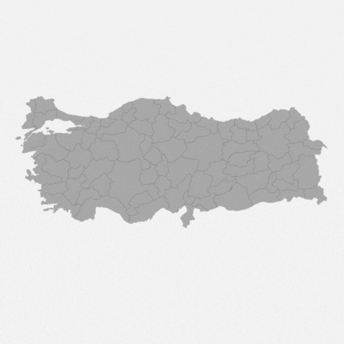
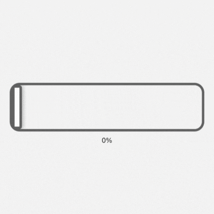
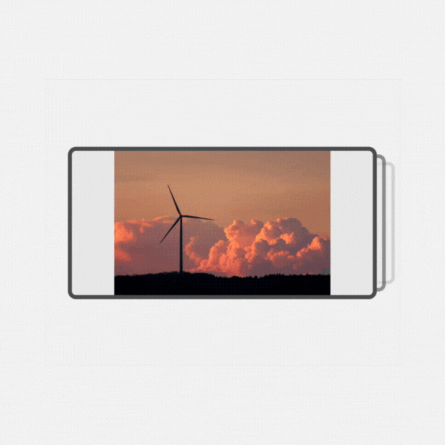
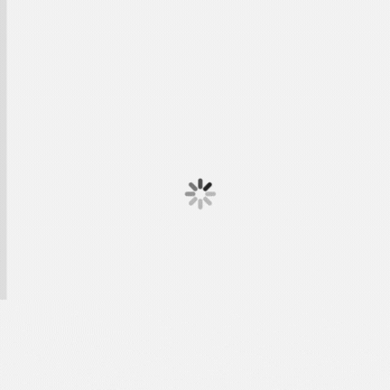

# React Native Tools

A collection of reusable React Native components and animated text effects built with Expo.

## Components

This project includes various ready-to-use components that you can integrate into your React Native applications:

### UI Components

#### Turkey Map SVG

```
<TurkeyMap
   width={width}
   height={(width * 422) / 1000}
   selectedProvinceId={selectedProvinceId}
   onProvincePress={setSelectedProvinceId}
   style={{width: '100%', height: 'auto'}}
/>
```



[svg source](https://simplemaps.com/svg/country/tr)

#### Quick Menu Button

```
<QuickMenuButton buttonColor={"#000000"} itemColor={"#919191"} />
```


#### Animated Slider

```
<AnimatedSlider initialPosition={50} />
```



#### QR Animation

```
<QrAnimation />
```


#### Image Gallery

```
<Gallery
   images={[
      {
      id: 1,
      image:
         "https://cdn.pixabay.com/photo/2023/05/01/18/06/windmill-7963566_1280.jpg",
      alt: "photo 1",
      },
   ]}
/>
```



### Animated Text Effects

#### Wave Effect


#### Moving Effect


#### Magnifying Effect



#### Randomized Effect


#### Shining Effect


#### Sliding Effect


## Getting Started

1. Install dependencies

   ```bash
   npm install
   ```

2. Start the app

   ```bash
   npx expo start
   ```

## Project Structure

```
app/                    # Demo screens for each component
components/             # Reusable components
  ├── animatedText/     # Text animation effects
  ├── AnimatedSlider.tsx
  ├── QuickMenuButton.tsx
  ├── QrAnimation.tsx
  └── turkeyMap/        # Turkey map components
```

## Technologies

- React Native
- Expo
- TypeScript
